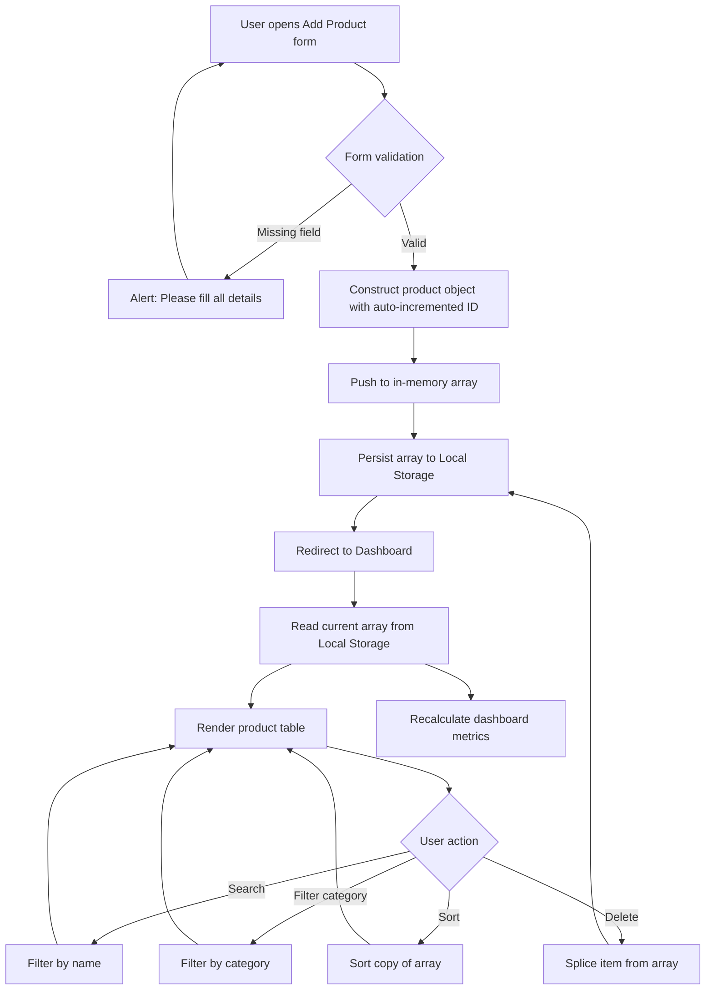

<div align="center">

# Stock गुरु (Guru)

### A Client-Side Inventory Management Dashboard

<p>
Stock ka hisab, bilkul laajawab — inventory accounting, done right.
</p>


<br/><br/>


<!--  -->

</div>

<br/>

<div>


<br/>
<a href="https://suman-das07.github.io/ledger-documentation/">Click to Read complete Project Documentation/ledger</a>
<br/>

## Overview

**Stock Guru** is a lightweight, front-end inventory management dashboard built entirely with vanilla HTML, CSS, and JavaScript. It allows a shop owner, small business, or individual to record products, track stock levels, monitor inventory value, and manage day-to-day stock operations directly from the browser, with no server, no database, and no external dependency required to run it.

The name reflects its purpose: managing **stock** in the sense of **inventory** — quantities, categories, and pricing of physical goods — and is unrelated to financial markets or stock trading. This distinction is stated clearly here to avoid any confusion for a reader encountering the name for the first time.

The project was built to demonstrate that a genuinely useful, production-quality tool can be created using only the fundamentals of the web platform: the DOM, the Web Storage API, and plain JavaScript logic, without reaching for a framework, a build tool, or a backend.

<br/>

## Why This Project Exists

Most portfolio projects reach for a framework before the fundamentals are proven. Stock Guru intentionally does the opposite. It was built as a demonstration of core front-end engineering competence:

- Direct DOM manipulation without a virtual DOM or templating library.
- State management using the Web Storage API as the single source of truth, with every read and write kept consistent across two separate HTML pages.
- Derived UI values (dashboard totals, stock status, sort order) computed on demand from raw data, rather than cached and allowed to drift out of sync.
- A deliberate, custom visual identity instead of a default component library look.

For a recruiter or a hiring manager, the value of this project is not that it reinvents inventory software. It is that every interaction on the page, the count going up on the dashboard, the badge changing colour, the table re-sorting, is wired by hand, which makes the underlying logic fully inspectable in the source code rather than hidden inside a dependency.

<br/>

## Core Features

- **Live Inventory Dashboard** — Displays total product count, low-stock count, out-of-stock count, and total inventory value, recalculated on every change.
- **Add Product Form** — A dedicated form page with field validation that rejects incomplete submissions before they reach storage.
- **Persistent Storage** — All product data is saved to the browser's local storage, so inventory survives page refreshes and browser restarts on the same device.
- **Dynamic Stock Status Badges** — Every product is automatically labelled *In Stock*, *Low Stock*, or *Out of Stock* based on its current quantity.
- **Search** — Instant lookup of a product by name using a case-insensitive partial match.
- **Category Filtering** — Narrow the product table down to a single category, such as Electronics, Accessories, or Networking.
- **Multi-Criteria Sorting** — Sort by name, price, quantity, or insertion order, in ascending or descending direction, without mutating the underlying dataset.
- **Delete Product** — Remove a product from inventory with an immediate refresh of both the table and the dashboard metrics.
- **Localized Currency Formatting** — Inventory value is formatted using Indian numbering conventions with compact notation for large totals.
- **Fully Responsive Layout** — A dedicated mobile breakpoint reflows the dashboard, navigation, and table into a single-column, touch-friendly layout.

<br/>

## Engineering Highlights and Unique Concepts

Anyone can build a form that writes to local storage. The details below are the decisions that separate this implementation from a tutorial copy:

- **Single Source of Truth, Re-Read on Every Operation** — Rather than keeping one long-lived array in memory that could silently fall out of sync with storage, every function (`renderTable`, `updateDashboardCards`, `searchItem`, `filterCategory`, `sortProducts`, `deleteProduct`) independently re-reads from local storage before acting. This trades a small amount of performance for a strong guarantee: the UI can never display stale data relative to what is actually persisted.
- **Non-Destructive Sorting** — `sortProducts` operates on a shallow copy of the array (`[...productsArray]`) rather than sorting in place, so the original insertion order and IDs are always preserved regardless of how the table is currently being viewed.
- **Self-Incrementing Identity System** — Product IDs are derived from the last stored item's ID at load time and incremented on each new entry, so identity remains stable and unique across sessions without a database auto-increment column.
- **Threshold-Driven Status Logic** — Stock status is not stored as a field on the product; it is computed at render time from a single quantity value (`0` for out of stock, under `10` for low stock), which means the business rule lives in exactly one function and cannot drift from the displayed badge.
- **Deliberate Typographic Hierarchy** — Three distinct typefaces are used with intent rather than convenience: a display face for headings, a barcode-styled face for the brand tagline (a direct visual nod to retail and stock-keeping), and a monospaced face for all tabular and numeric data, so figures always align predictably.
- **Bilingual Brand Identity** — The interface pairs an English product name with a Hindi tagline, a small but deliberate branding choice that signals attention to localization and audience rather than a purely default English-only interface.
- **CSS-Only Ambient Motion** — The animated dotted background grid is achieved with a single `@keyframes` rule shifting a repeating radial gradient, avoiding any JavaScript animation loop or external animation library.
- **Zero Dependencies, Zero Build Step** — The entire application runs by opening an HTML file. There is no `npm install`, no bundler, and no transpilation step standing between the source code and the running application.

<br/>

## Application Workflow

The diagram below traces how a single product moves through the system, from data entry to being reflected across the dashboard.



<br/>

## Technology Stack

<table>
<tr><th>Layer</th><th>Technology</th><th>Purpose</th></tr>
<tr><td>Structure</td><td>HTML5</td><td>Semantic markup for the dashboard and form pages</td></tr>
<tr><td>Styling</td><td>CSS3</td><td>Layout, responsive breakpoints, glassmorphism effects, keyframe animation</td></tr>
<tr><td>Behaviour</td><td>JavaScript (ES6+)</td><td>DOM manipulation, event handling, data logic</td></tr>
<tr><td>Persistence</td><td>Web Storage API (localStorage)</td><td>Client-side data storage, no backend required</td></tr>
<tr><td>Iconography</td><td>Remix Icon</td><td>Interface icons via CDN</td></tr>
<tr><td>Typography</td><td>Google Fonts — Yuyu Short, Libre Barcode 128 Text, Space Mono</td><td>Display, brand, and data typefaces</td></tr>
</table>

<br/>

## Project Structure

```
stock-guru/
├── index.html          Dashboard page: metrics, search, filter, sort, product table
├── form.html            Add Product page with validated input form
├── app.js                Application logic: storage, rendering, search, filter, sort
├── style.css             Full stylesheet, animations, and responsive rules
├── assets/
│   └── stockGuruFavicon.png
└── README.md
```

<br/>

## Getting Started

No installation, package manager, or build process is required.

1. Clone the repository.

```bash
git clone https://github.com/suman-das07/stock-guru.git
```

2. Open `index.html` directly in a web browser.

```bash
cd stock-guru
open index.html
```

3. Use the **Add Item** button to record your first product, then return to the dashboard to see it reflected in the table and metrics instantly.

<br/>

## Design System

The interface follows a dark, glass-panel aesthetic with a single accent colour used consistently for primary actions and positive stock status.

<table>
<tr><th>Element</th><th>Choice</th><th>Reasoning</th></tr>
<tr><td>Background</td><td>Charcoal (#181818) with animated dotted grid</td><td>Reduces visual fatigue for a dashboard viewed for extended periods</td></tr>
<tr><td>Cards and Table</td><td>Semi-transparent panels with backdrop blur</td><td>Creates depth without relying on heavy borders or shadows</td></tr>
<tr><td>Accent Colour</td><td>Signal green</td><td>Reserved for primary actions and healthy stock status, so it always signals "good"</td></tr>
<tr><td>Headings Typeface</td><td>Yuyu Short</td><td>Distinct display character for section titles</td></tr>
<tr><td>Brand Tagline Typeface</td><td>Libre Barcode 128 Text</td><td>A literal barcode rendering, tying the visual identity directly to retail and stock-keeping</td></tr>
<tr><td>Data Typeface</td><td>Space Mono</td><td>Monospacing keeps prices and quantities visually aligned in the table</td></tr>
</table>

<br/>

## Known Limitations and Honest Scope

This section exists so that anyone evaluating the project, technically or otherwise, understands exactly what it is and is not:

- Data is stored per browser, on a single device. It is not synced across devices and is not shared between users.
- There is no authentication layer and no access control; anyone with access to the browser can view or edit the stored inventory.
- There is no backend API or database; all logic runs client-side.
- Clearing browser storage will permanently remove all recorded inventory data.
- The project is intentionally scoped as a front-end demonstration rather than a production inventory system for a live business.

<br/>

## Roadmap

- [ ] Optional backend with a real database for multi-device sync.
- [ ] User accounts and role-based access.
- [ ] Edit-in-place for existing products, in addition to add and delete.
- [ ] CSV export of the current inventory table.
- [ ] Low-stock email or notification alerts.

<br/>

## Contributing

Issues and pull requests are welcome. For significant changes, please open an issue first to discuss the proposed change.

<br/>

<br/>

## Author

<table>
<tr><td><b>Developer</b></td><td>Suman Das</td></tr>
<tr><td><b>Repository</b></td><td><a href="https://github.com/suman-das07/stock-guru">github.com/suman-das07/stock-guru</a></td></tr>
</table>

</div>
